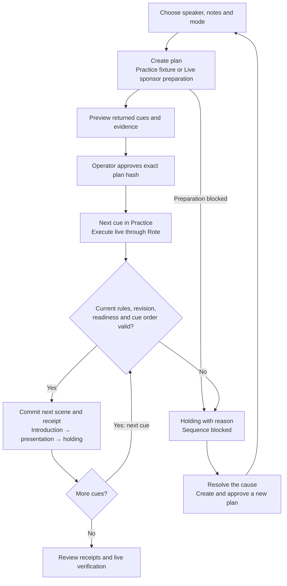

<div align="center">

# Greenroom

### Rehearse once. Reuse safely.

<p>
  
  
  
  
  
  
</p>

**Greenroom** is a live-show director that learns a rehearsed cue sequence and reuses it for another speaker. The operator approves an exact plan; the backend re-checks current production rules, show revision, asset readiness and cue order before every stage change. A missing presentation sends the show to holding with a clear reason, and restoring the asset never resumes the invalidated plan.

> **One segment. Three speakers. One stage.** Introduction → presentation → holding.

[Architecture](#system-architecture) · [Guard chain](#the-guard-chain) · [Quick start](#quick-start) · [Demo speakers](#demo-speakers) · [Evidence and limits](#evidence-and-limits)

[PowerPoint deck](output/presentation/Greenroom-Demo.pptx) ·
[Demo walkthrough](docs/demo-recording.md) ·
[Verification](docs/sponsor-readiness.md)

</div>

---

## What Makes This Different

Replaying a captured sequence reproduces what was recorded. Greenroom treats each replayed cue as a request that must re-earn permission against current conditions — so the guarantees below are the ones replay alone does not provide by construction.

| Replay alone | Greenroom adds |
|---|---|
| Reproduces the sequence as captured | Re-checks live conditions before each cue commits |
| No approval step beyond starting playback | Operator approves an **exact plan hash**; anything else is rejected |
| No check that the captured conditions still hold | A show revision change invalidates the approved plan, mid-run included |
| No readiness gate before a cue fires | Speaker and asset readiness re-queried at execution time, not trusted from planning |
| No idempotency on a retried step | Deterministic request IDs return the original receipt instead of firing twice |
| Progress tracked wherever playback runs | The API owns stage truth; the browser renders it and never invents it |
| One outcome: it ran | `completed` (cues finished) is distinct from `verifiedCompletion` |

---

## System Architecture

```
╔═══════════════════════════════════════════════════════════════════════════╗
║                    Greenroom — one segment, end to end                    ║
╠═══════════════════════════════════════════════════════════════════════════╣
║                                                                           ║
║  Operator desk  /                         Projected stage  /stage         ║
║  ───────────────────────                  ─────────────────────────       ║
║  Speaker · notes · mode                   Renders the API scene           ║
║  Plan preview and approval                Polls stage every 500 ms        ║
║  Execution receipts                       Invents no local progress       ║
║           │                                          │                    ║
║           └────────────────────┬─────────────────────┘                    ║
║                                ▼                                          ║
║                   ┌─────────────────────────┐                             ║
║                   │   Vite proxy  :5173     │   operator token is         ║
║                   │   loopback only         │   server-side only          ║
║                   └────────────┬────────────┘                             ║
║                                │  /api/v1                                 ║
║                                ▼                                          ║
║  ┌────────────────────────────────────────────────────────────────┐       ║
║  │           Greenroom API  :8787  —  owner of stage truth        │       ║
║  │   FastAPI · SQLite                                             │       ║
║  │   state · runs · receipts · receipt_requests                   │       ║
║  └──────┬──────────────────┬──────────────────────┬───────────────┘       ║
║         │                  │                      │                       ║
║         ▼                  ▼                      ▼                       ║
║  ┌──────────────┐   ┌───────────────┐   ┌────────────────────┐            ║
║  │ Cognee +     │   │  hotdata.dev  │   │    RocketRide      │            ║
║  │ HydraDB      │   │               │   │    orchestration   │            ║
║  │              │   │ current show  │   │                    │            ║
║  │ rule graph · │   │ snapshot and  │   │ prepare → plan →   │            ║
║  │ provenance · │   │ readiness     │   │ execute → verify   │            ║
║  │ outcomes     │   │ queries       │   │                    │            ║
║  └──────────────┘   └───────────────┘   └─────────┬──────────┘            ║
║                                                   │ HTTPS + bridge token  ║
║                                                   ▼                       ║
║                                         ┌──────────────────────┐          ║
║                                         │  Restricted bridge   │          ║
║                                         │  :8788               │          ║
║                                         │  six named tools,    │          ║
║                                         │  nothing else        │          ║
║                                         └─────────┬────────────┘          ║
║                                                   │                       ║
║                                                   ▼                       ║
║  ┌────────────────────────────────────────────────────────────────┐       ║
║  │             Rote  —  learn once, replay per speaker            │       ║
║  │   Ordered, authenticated cue requests with deterministic IDs   │       ║
║  └───────────────────────────────┬────────────────────────────────┘       ║
║                                  │  one request per cue                   ║
║                                  ▼                                        ║
║  ┌────────────────────────────────────────────────────────────────┐       ║
║  │           THE GUARD CHAIN  —  runs before every commit         │       ║
║  │                                                                │       ║
║  │   1  Approval     the exact plan hash the operator approved    │       ║
║  │   2  Revision     show revision unchanged since that approval  │       ║
║  │   3  Readiness    speaker and presentation asset still ready   │       ║
║  │   4  Order        cue is next in sequence, run owns the stage  │       ║
║  │                                                                │       ║
║  │   All four pass  →  commit the scene and a durable receipt     │       ║
║  │   Any one fails  →  stage goes to holding, with the reason     │       ║
║  └───────────────────────────────┬────────────────────────────────┘       ║
║                                  │                                        ║
║              ┌───────────────────┼───────────────────┐                    ║
║              ▼                   ▼                   ▼                    ║
║       introduction         presentation           holding                 ║
║       receipt              receipt                default and fallback    ║
║                                                                           ║
╚═══════════════════════════════════════════════════════════════════════════╝
```

The API is the single owner of stage truth. Each cue is a transaction: it passes the guard chain or it does not commit. Retrying the same cue request ID returns its original receipt rather than firing twice. Operator cancellation waits for active drivers to stop and preserves receipts already committed.

Read-only `GET`s need no token. The loopback Vite proxy adds authentication to mutations, so operator credentials never enter the client bundle. [Architecture details →](docs/greenroom-architecture.md)

---

## The Guard Chain

Four checks run inside every cue transaction, in order, before anything is written. They are ordinary code and SQL — no model decides whether the stage may change.

### 1 — Approval

The operator approves a specific plan by its hash. A cue carrying any other plan identity is rejected. Approval is not a mode the run stays in; it is bound to exact content.

### 2 — Revision

The show revision is compared against the revision at approval time. Changed production notes invalidate the approved plan, mid-run included. The recovery path is a new plan and a new approval, never a resumed one.

### 3 — Readiness

The speaker and their presentation asset are re-checked against a current snapshot from hotdata.dev. Readiness verified at planning time is not trusted at execution time; it is queried again.

### 4 — Order and ownership

The cue must be the next one in the sequence, and the run requesting it must own the stage. Out-of-order and orphaned cues are rejected rather than reordered.

**All four pass** → the scene commits with a durable receipt.
**Any one fails** → the stage goes to holding and the reason is recorded and shown.

---

## Run Modes

| Mode | What actually happens |
| --- | --- |
| **Local API · Practice** | Local UI rehearsal: a fixture plan, operator approval and three real API stage cues with durable receipts. No sponsor execution claim. |
| **Local API · Live** | Verified sponsor preparation and Rote learning/replay. Missing setup or evidence blocks progress. |
| **Fixture data** | Explicitly labelled browser fixtures for UI rehearsal. Separate local state; never a fallback for failed API requests. |

Live execution checks every cue automatically. Practice advances one cue per operator action. Restoring an asset never resumes an invalidated plan.

---

## Product Flow



The per-run sequence across every sponsor — prepare, plan, approve, execute, verify — is diagrammed in [the architecture doc](docs/greenroom-architecture.md#one-run).

---

## The Restricted Bridge

RocketRide runs off-machine, so the surface it can reach is deliberately small. The public bridge on `:8788` permits authenticated health, one redacted single-run read, and exactly six named tools:

| Tool | Purpose |
|---|---|
| `ingest-memory` | Extract production rules from the operator's notes |
| `recall-recipe` | Recall the rule graph with source provenance |
| `validate-show` | Load a current snapshot and query readiness |
| `plan` | Build the exact cue plan offered for approval |
| `execute` | Run the approved phase |
| `verify` | Reconcile outcomes and write back a bound result |

Operator controls, direct stage cues, production notes, raw evidence and run enumeration stay on loopback and are never exposed through the bridge.

---

## Data Model — 4 Tables

SQLite, created on first start. Small on purpose: the receipt trail is the product.

| Table | Holds |
|---|---|
| `state` | Current stage scene and show state, keyed |
| `runs` | Every run, its plan, approval hash and status |
| `receipts` | Durable per-cue receipts — the evidence trail |
| `receipt_requests` | Request-ID ledger that makes cue retries idempotent |

Run statuses: `queued` · `needs_approval` · `approved` · `running` · `completed` · `blocked` · `failed`
Provider statuses: `verified` · `blocked` · `failed` · `fixture`

---

## Tech Stack

| Layer | Choice |
|---|---|
| **API** | Python 3.12 · FastAPI 0.141 · uvicorn · httpx |
| **Store** | SQLite — plans, claims, receipts, stage |
| **Desk and stage** | React 19.3 · TypeScript 7.0 · Vite 8.3 · lucide-react |
| **Orchestration** | RocketRide, reaching the app only through the restricted bridge |
| **Procedure memory** | Rote — learn a procedure once, replay it per speaker |
| **Rule graph** | Cognee for extraction, HydraDB (neo4j driver) for graph, provenance and outcomes |
| **Readiness** | hotdata.dev — current show snapshot and queries |
| **Security scanning** | Snyk — source and dependencies |

---

## Project Structure

```
Greenroom/
├── greenroom/
│   ├── api.py                  # FastAPI app, guard chain, stage truth, SQLite
│   ├── bridge.py               # Restricted public surface on :8788
│   ├── acceptance.py           # Live acceptance runner
│   ├── contracts/api.ts        # Frozen v1 contract shared with the frontend
│   ├── integrations/
│   │   ├── memory.py           # Cognee + HydraDB
│   │   ├── hotdata.py          # Readiness snapshots and queries
│   │   ├── rote.py             # Learn / replay adapter
│   │   └── rocketride.mjs      # Pipeline validation and execution
│   ├── pipelines/              # RocketRide .pipe + component schemas
│   ├── plays/stage-sequence/   # Rote play definition
│   ├── tests/                  # 12 Python test modules + RocketRide node tests
│   └── web/
│       ├── src/                # Operator desk and projected stage
│       └── verification/       # Transport, operator and security checks
├── docs/                       # Architecture, acceptance, demo, readiness
├── sponsor-setup/              # Per-sponsor setup, smoke checks and doctor
└── output/                     # Architecture renders and the pitch deck
```

---

## Quick Start

### Prerequisites

**Python 3.12, Node.js and pnpm.** Package-manager versions are pinned in the root and frontend manifests. Practice mode needs no sponsor accounts.

### 1 — Install

```sh
git clone https://github.com/nr1306/Greenroom.git
cd Greenroom
python3.12 -m venv sponsor-setup/memory/.venv
sponsor-setup/memory/.venv/bin/python -m pip install -r greenroom/requirements.txt
pnpm --dir greenroom/web install --frozen-lockfile
```

### 2 — Start the API

```sh
# Terminal 1 — serves 127.0.0.1:8787
sponsor-setup/memory/.venv/bin/python -m greenroom.api
```

On first startup the API creates `greenroom/.env`. Privately copy only its `GREENROOM_OPERATOR_TOKEN` value into `greenroom/web/.env.local` using the same variable name. Both files are ignored. **Never use a `VITE_` prefix for this secret.**

### 3 — Start the desk

```sh
# Terminal 2, from the repository root
pnpm --dir greenroom/web dev
```

Open the [desk](http://127.0.0.1:5173/) and [stage](http://127.0.0.1:5173/stage) in separate windows. Restart Vite after changing the token. Use `pnpm dev` for the authenticated proxy; `pnpm preview` serves static files only. [Full frontend guide →](greenroom/web/README.md)

### 4 — Going live

For Live mode, complete [sponsor setup](SPONSOR_SETUP.md) and the [restricted bridge setup](greenroom/BRIDGE.md), then follow the [live acceptance guide](greenroom/ACCEPTANCE_RUNNER.md). A new machine needs private credentials and its own learned Rote play.

---

## Demo Speakers

| Speaker | Role | Demonstrates |
|---|---|---|
| **Maya Chen** | Opening speaker | **Learn** — a real Rote learning pass producing the reusable procedure |
| **Ravi Shah** | Product demo | **Reuse** — the same learned package, new speaker inputs, new receipts |
| **Alex Rivera** | Closing speaker | **Interrupt** — presentation pulled mid-run; the stage holds |

### Try the safety demo

1. Select **Local API → Practice**, choose a speaker and **Create practice run**.
2. Preview the three cues, **Approve plan**, then press **Next cue** three times.
3. Create and approve another run. Advance the introduction, then turn off **Presentation**. Observe the API's holding scene and rejection reason.
4. Restore presentation readiness, **Create recovery plan**, approve and advance.

---

## Running Tests

The repository contains **124 Python test methods across 12 modules**, plus **17 RocketRide**, **9 transport** and **4 operator** Node tests. Run them to see current results:

```sh
sponsor-setup/memory/.venv/bin/python -m unittest discover -s greenroom/tests -v
pnpm --dir greenroom/web verify:transport
pnpm --dir greenroom/web verify:operator
pnpm --dir greenroom/web build
pnpm --dir greenroom/web format:check

# Root dependencies support RocketRide checks and configured Live execution
pnpm install --frozen-lockfile
pnpm test:greenroom:rocketride
pnpm check:greenroom:pipeline
pnpm security:scan
```

---

## Evidence and Limits

Recorded on the configured demo machine on **September 11, 2026, at 22:35 UTC**:

| Scenario | Recorded result |
| --- | --- |
| **Maya: learn** | Actual Rote learning; three matched canonical cue receipts. |
| **Ravi: reuse** | Same learned package, new speaker inputs and three new receipts. |
| **Alex: interrupt** | Presentation removed after introduction; one receipt retained, presentation blocked, stage holding. |

[Sponsor evidence](docs/sponsor-readiness.md) describes these runs. Physical cue completion, Rote/Hydra verification and RocketRide orchestration are separate checks. **No speed or cost reduction is claimed.**

`completed` means physical cues finished. `verifiedCompletion` additionally requires verified Rote execution and Hydra outcome write-back; the final RocketRide trace establishes orchestration completion.

---

## Security

The documented Snyk scans report zero source findings and zero reported frontend or minimal Python-runtime dependency vulnerabilities. **Six root/optional setup dependency advisories remain unresolved.** See [security scope and findings](SECURITY.md).

Credentials, runtime databases, generated Rote plays and raw scan reports stay local and are git-ignored.

---

## Scope

Current scope excludes streaming accounts, OBS, microphones, scheduling and multitenancy. Earlier Dock proposals under `docs/architecture/` are historical and do not describe the current system.

---

## Entry Points

| Area | Entry point |
| --- | --- |
| Frontend — oasb16 | [Operator desk and stage](greenroom/web/README.md) |
| Backend and sponsors — Jayesh | [API](greenroom/api.py), [handoff](greenroom/TEAMMATE_HANDOFF.md) |
| Shared API | [Frozen v1 contract](greenroom/contracts/api.ts) — coordinate changes |
| Acceptance | [Backend checks](docs/backend-acceptance.md), [frontend verification](greenroom/web/VERIFICATION.md) |
