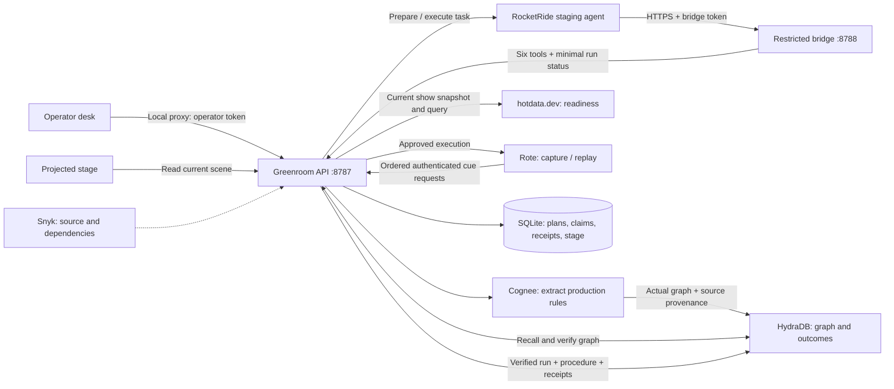

# Greenroom system architecture

Greenroom directs one segment: introduction → presentation → holding. The operator
approves an exact plan. RocketRide orchestrates sponsor tools; Rote records or
replays the approved sequence. The local API commits each stage change only after
checking current production rules, readiness, step order and stage ownership.



The public bridge permits only authenticated health, a redacted single-run read,
and the six named tools. Operator controls, direct stage cues, production notes,
raw evidence and run enumeration stay on loopback. The frontend does not receive
operator or sponsor secrets; its development server injects the operator token.

## One run

```mermaid
sequenceDiagram
  participant O as Operator
  participant A as Greenroom API
  participant R as RocketRide
  participant M as Cognee + HydraDB
  participant H as hotdata.dev
  participant P as Rote
  O->>A: Create live run with current production notes
  A->>R: Prepare
  R->>A: Ingest → recall
  A->>M: Extract/re-export graph; persist and verify exact provenance
  R->>A: Validate show
  A->>H: Load current snapshot; query speaker/asset/revision
  R->>A: Build plan
  A-->>O: Exact plan and hash, awaiting approval
  O->>A: Approve hash and execute
  A->>R: Execute phase
  R->>A: Revalidate readiness after approval
  A->>H: Query current snapshot
  R->>A: Execute
  A->>P: Fresh approved run: learn or replay compatible procedure
  loop intro → presentation → holding
    P->>A: Next cue with deterministic request ID
    A->>A: Check rules + revision + readiness + ownership; commit receipt
    A-->>P: Canonical receipt
  end
  P-->>A: Match captured outcomes to canonical receipts
  R->>A: Verify
  A->>M: Write and read back successful outcome bound to procedure
  A-->>R: Verified completion
  R-->>A: Reconciled execution result
```

## What improves between runs

Maya teaches a reusable Rote procedure. Ravi supplies a different speaker/run and
gets newly committed receipts from the same procedure. Unchanged production notes
reuse extraction while Cognee re-exports the graph and Hydra verifies provenance.
Hotdata still checks current readiness. Successful outcomes accumulate in Hydra
with the exact rule and procedure identity; they do not replace readiness checks.

If Alex's slides become unavailable after introduction, the API immediately holds
the stage. The next presentation cue is rejected, and only the introduction
receipt remains. Restoring readiness cannot resume the invalidated plan. Changed
production notes similarly invalidate old plans. Operator cancellation waits for
active drivers to stop and preserves any already committed receipts.

`completed` means physical cues finished. `verifiedCompletion` additionally
requires verified Rote execution and Hydra outcome write-back; the final
RocketRide trace establishes orchestration completion. Practice uses explicitly
labelled fixture plans. See the [acceptance runner](../greenroom/ACCEPTANCE_RUNNER.md)
and [security status](../SECURITY.md) for evidence and remaining gates.
